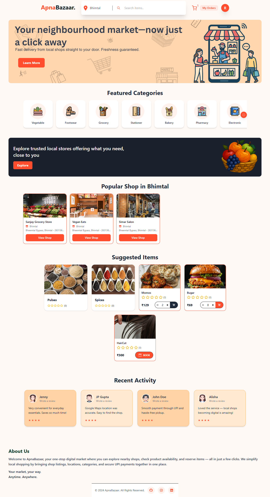
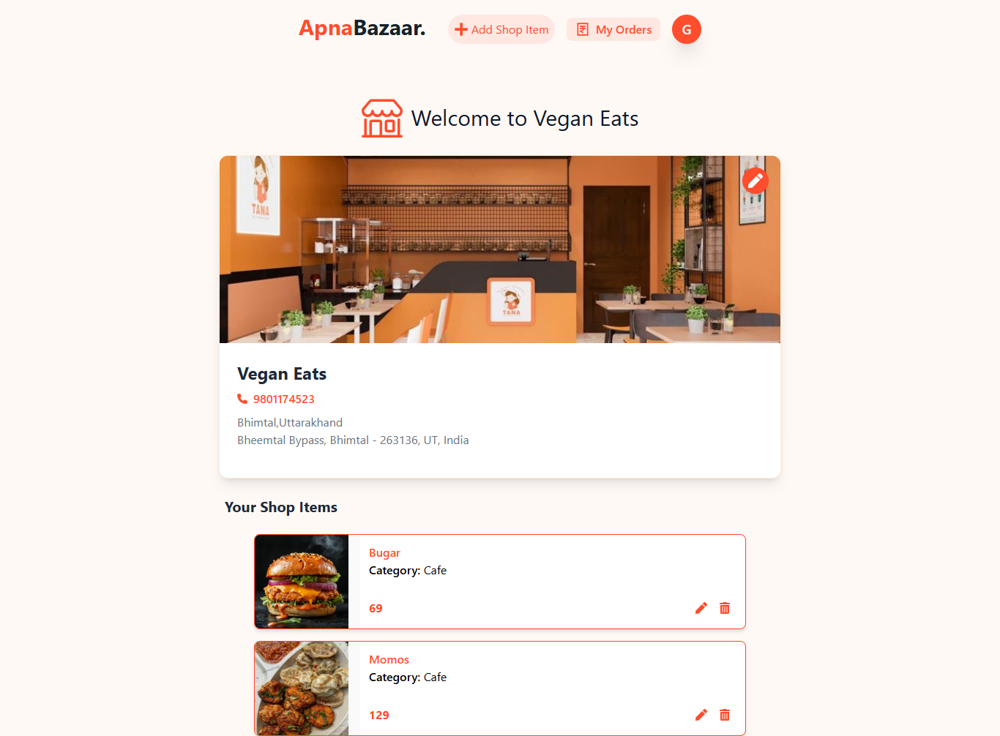
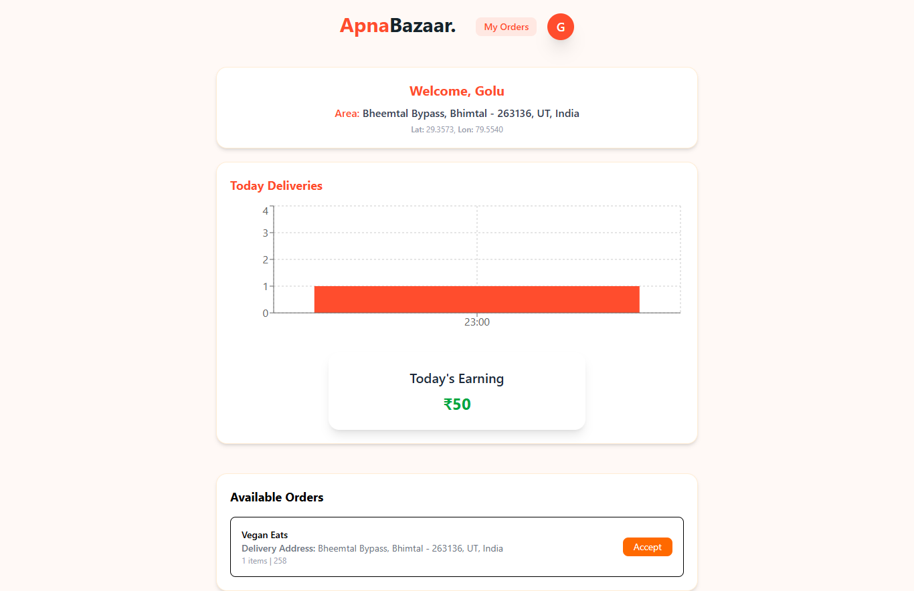

# ApnaBazaar - Advanced Multi-Service Marketplace 🛒



ApnaBazaar is a modern, high-performance marketplace application that empowers local businesses by providing three distinct operational modes: **Order**, **Booking**, and **Display**. Built with the **MERN Stack**, it features real-time tracking, premium UI/UX, and a unified platform for commerce and services.

---

## 🚀 Professional Dashboards


<p align="center"><i>Powerful Seller Controls for Orders, Bookings, and Showcases</i></p>


<p align="center"><i>Real-time Delivery Management with Geolocation Support</i></p>

Unlike traditional marketplaces, ApnaBazaar adapts to the nature of your business:

- **🛒 Order Mode**: Perfect for grocery stores, bakeries, and pharmacies. Complete with cart management, UPI payments, and order tracking.
- **📅 Booking Mode**: Designed for service providers like Salons, Tailors, and Consultants. Features a streamlined appointment booking system.
- **🖼️ Display Mode**: Ideal for high-end galleries, car showrooms, or jewelry boutiques. Focuses on premium visual showcase without direct transactions.

---

## ✨ Key Features

### 👤 For Customers
- **Multi-Service Hub**: Access groceries, services, and showrooms from a single app.
- **Location-based Discovery**: Automatically finds shops and products in your current city.
- **Real-time Tracking**: Integrated WebSocket support for live order status updates.
- **Premium Auth**: Secure login via Firebase Google Auth or traditional Email/Password.

### 🏪 For Sellers
- **Mode-Specific Dashboards**: Custom UI controls based on your shop's selected mode (Order/Booking/Display).
- **Business Management**: Full control over shop details, inventory, and service listings.
- **Management Center**: Dedicated "My Orders" or "My Bookings" hubs to track customer interactions.

### 🚴 For Delivery Partners
- **Smart Assignment**: View and accept delivery tasks within your city.
- **One-Tap Updates**: Quickly update order status to keep customers informed.

---

## 🛠️ Tech Stack

- **Frontend**: React.js (Vite), Redux Toolkit, Tailwind CSS, Lucide Icons.
- **Backend**: Node.js, Express.js, Socket.io (Real-time events).
- **Database**: MongoDB (Mongoose ODM).
- **Security**: Firebase Authentication, JWT, bcryptjs.
- **Media**: Cloudinary (High-speed image delivery).

---

## ⚙️ Local Setup

1. **Clone the repository:**
   ```bash
   git clone https://github.com/Rajnandini0508/ApnaBazaar.git
   cd ApnaBazaar
   ```

2. **Backend Setup:**
   ```bash
   cd server
   npm install
   # Create a .env file with MONGODB_URI, JWT_SECRET, etc.
   npm run dev
   ```

3. **Frontend Setup:**
   ```bash
   cd ../frontend
   npm install
   # Create a .env file with VITE_FIREBASE_APIKEY, etc.
   npm run dev
   ```

---

## 🛡️ Environment Variables

**Server:** `MONGODB_URI`, `JWT_SECRET`, `EMAIL`, `PASS`, `CLOUDINARY_CLOUD_NAME`, `CLOUDINARY_API_NAME`, `CLOUDINARY_API_SECRET`, `RAZORPAY_KEY_ID`, `RAZORPAY_KEY_SECRET`

**Frontend:** `VITE_FIREBASE_APIKEY`, `VITE_GEOAPIKEY`, `VITE_RAZORPAY_KEY_ID`

---

## 📄 License
This project is open-source and available under the [MIT License](LICENSE).
